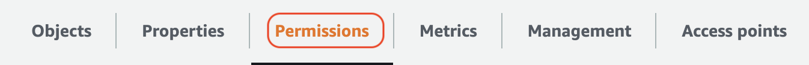
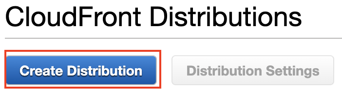
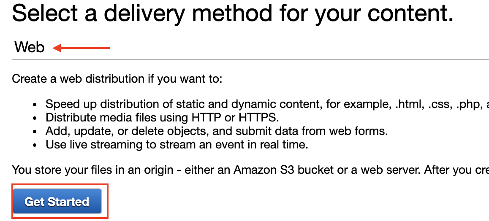
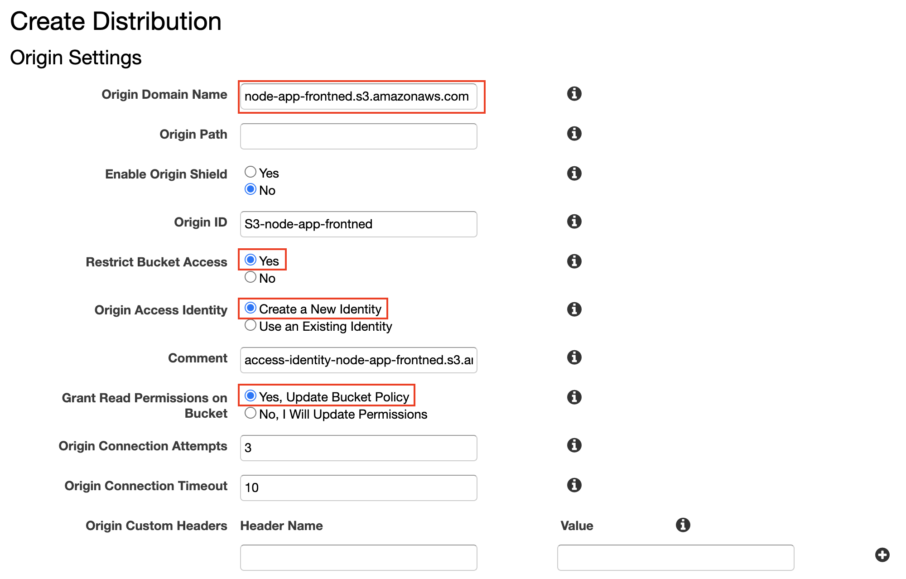
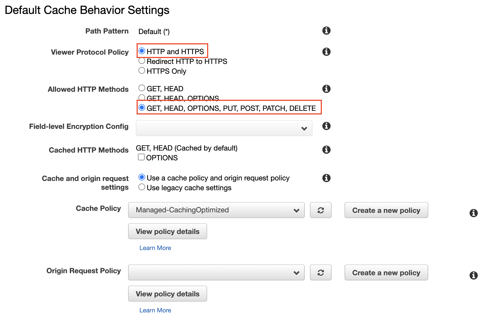
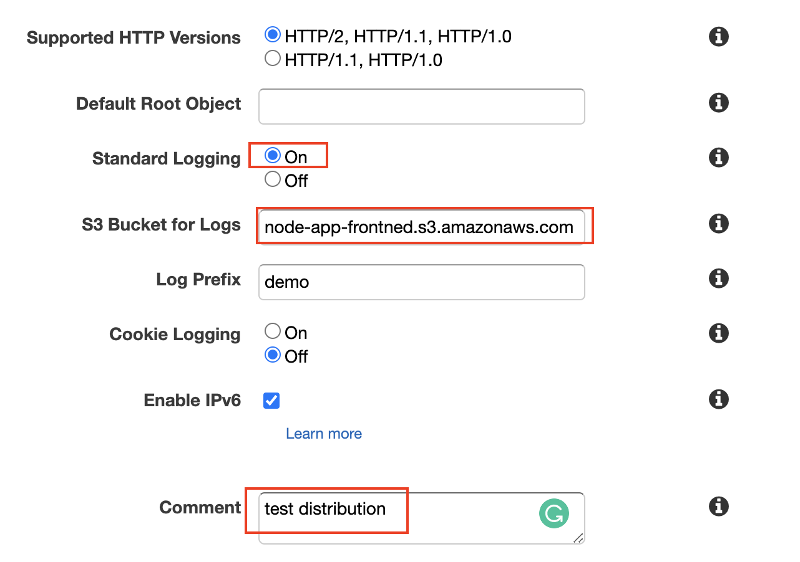

# Note
## Install dependencies
```
npm i --save express nodemon dotenv sequelize sequelize-cli pg bcrypt body-parser jsonwebtoken express-validator cors
```
## Configure environment variable


## Configure .sequelizerc
create .sequelizerc
```
touch .sequelizerc
```
past the code below for `sequelize init`
```
const path = require('path');

module.exports = {
    "config": path.resolve('./config', 'database.js'),
    "models-path": path.resolve('models'),
    "seeders-path": path.resolve('database', 'seeders'),
    "migrations-path": path.resolve('database', 'migrations')
}
```
initialize sequelize
```
sequelize init
```
## sequelize CLI
### Create User
```
sequelize model:create --name User --attributes firstName:string,lastName:string,email:string,password:string,gender:string,avatar:string
```
### Create/Update Migration
```
sequelize db:migrate
```
### Drop Migrated Tables
```
sequelize db:migrate:undo
```
### Create Seeder
```
sequelize seed:create --name users
```
### sequelize Seeder
```
sequelize db:seed:all    
```
### Drop Seeder
```
sequelize db:seed:undo
```

### Create Chat
```
sequelize model:create --name Chat --attributes type:string
```
### Create Chat User
```
sequelize model:create --name ChatUser --attributes chatId:integer,userId:integer
```
### Create Message
```
sequelize model:create --name Message --attributes type:string,message:text,chatId:integer,fromUserId:integer
```
# Deploy on AWS EC2
## Spec
- Ubuntu 18.04
- t3-small
## Set up Environment in cloud shell
```
curl -sL https://deb.nodesource.com/setup_12.x | sudo -E bash -
sudo apt-get install -y nodejs
sudo ln -s /usr/bin/nodejs /usr/bin/node
sudo apt install nginx
sudo npm install -g sequelize-cli sequelize pg express nodemon dotenv sequelize sequelize-cli pg bcrypt body-parser jsonwebtoken express-validator cors
```
### Check if environment is set up
```
node -v
npm -v
```
###  Test if Nginx installed correctly
```
curl localhost
```
### Install Node Version Manage
[Github Repo](https://github.com/nvm-sh/nvm)
```
curl -o- https://raw.githubusercontent.com/nvm-sh/nvm/v0.37.2/install.sh | bash
```
#### Check nvm and change the version of node
```
nvm ls-remote --lts
nvm install 12.18.3
```
### PostgreSQL
#### Installation
[Installation guide](https://stackoverflow.com/questions/53434849/cannot-install-postgres-on-ubuntu-e-unable-to-locate-package-postgresql)
```
sudo apt-get install postgresql postgresql-client
```
### Set up DB password
```sql
sudo -u postgres psql
\password
\q
```
### Log in DB 
```sql
psql  -U postgres -h localhost
```
### Create an database
```
CREATE DATABASE chatapp;
```
### Show the database
```sql
\l
```
### Switching to the database 
```sql
\c chatapp;
```
### Create a new user
```
CREATE USER tom;
```
### Set password for the new user
```
\password tom;
```
### Grant all privileges to the new user 
```sql
GRANT ALL PRIVILEGES ON DATABASE chatapp TO tom;
```
### Log in the new user and switch to the database 
```bash
psql -U tom -h localhost -d chatapp;
```
# Deployment
## Clone project
```
git clone https://github.com/ChenTsungYu/chat-app-backend.git
cd chat-app-backend
```
## Create `.env`
```
sudo vim .env
```
### Past the config
```
APP_KEY=YourAppKey
APP_URL=http://YourIP
APP_PORT=3000
DB_HOST=YourDBHost
DB_USER=YourDBUserName
DB_PASSWORD=YourDBPassword
DB_DATABASE=chatApp
```
#### save and quit
```
:wq!
```
## Install process manager
```
sudo npm install pm2@latest -g
```
Start your app using the process manager
```
pm2 start app.js
```
## Configure Nginx
```
sudo vim /etc/nginx/sites-available/chatapp.conf
sudo ln -s /etc/nginx/sites-available/chatapp.conf /etc/nginx/sites-enabled
sudo nginx -t
sudo systemctl restart nginx
```
## Configure pm2
```
sudo pm2 startup
sudo env PATH=$PATH:/usr/bin /usr/lib/node_modules/pm2/bin/pm2 startup systemd -u ubuntu --hp /home/ubuntu
sudo systemctl enable pm2-root
sudo pm2 save
sudo systemctl start pm2-root
```
Check the status of `pm2-root`
```
sudo systemctl status pm2-root
```
# Config in AWS S3 & CloudFront
## S3
### 步驟
1. 選擇AWS S3 服務，點擊進入目標 Bucket
2. 點擊 **Permissions**，至頁面底部找到 **Cross-origin resource sharing (CORS)**，點擊 **Edit**


3. 貼上下方設定，修改 `AllowedOrigins`成 EC2 的網域
```json=
[
    {
        "AllowedHeaders": [
            "*"
        ],
        "AllowedMethods": [
            "GET",
            "PUT",
            "POST",
            "DELETE",
            "HEAD"
        ],
        "AllowedOrigins": [
            "http://YourEC2Domain"
        ],
        "MaxAgeSeconds": 3000
    }
]
```
4. 儲存修改

## CloudFront
1. 進入 **CloudFront console**
2. 選擇 **Create Distribution**

3. 選擇 **Web**

4. 選擇**目標 S3 URL** 作為 **Origin Domain Name**，其餘依紅匡指示進行設定

5. 設定 **Cache**

6. 依照下圖設定 S3 Bucket log

7. 完成 Distribution 建立

## Reference
- [Cross-origin resource sharing (CORS)](https://docs.aws.amazon.com/AmazonS3/latest/dev/cors.html)
- [How to set up a CloudFront distribution for Amazon S3](https://aws.amazon.com/cloudfront/getting-started/S3/)
- [I’m using an S3 website endpoint as the origin of my CloudFront distribution. Why am I getting 403 Access Denied errors?](https://aws.amazon.com/premiumsupport/knowledge-center/s3-website-cloudfront-error-403/)
- [Why you should (almost) never use an absolute path to your APIs again](https://www.freecodecamp.org/news/never-use-an-absolute-path-for-your-apis-again-9ee9199563be/)